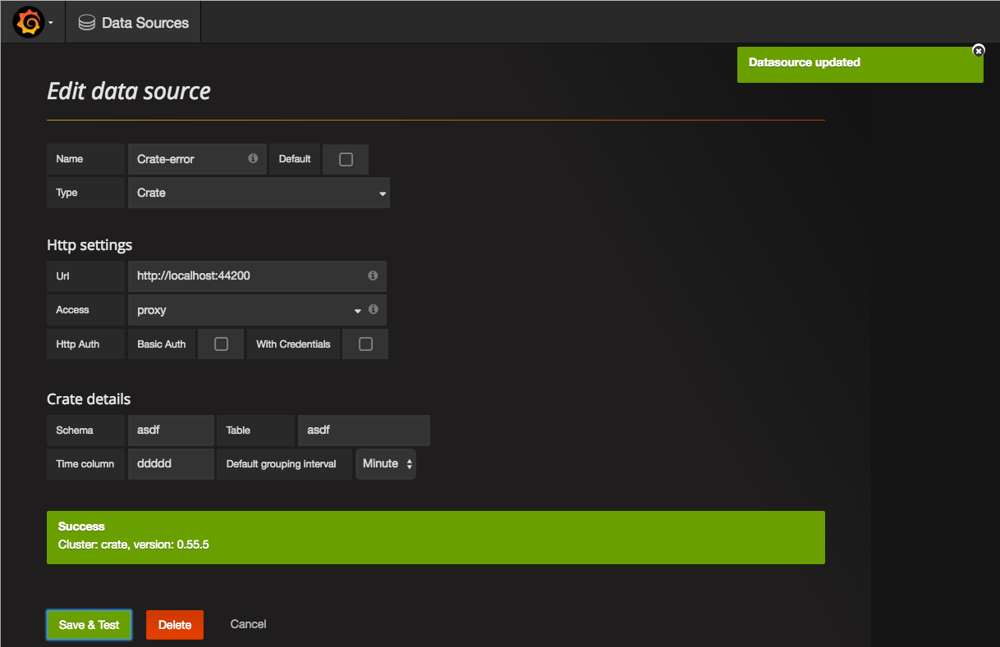
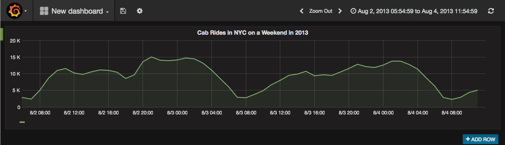

# Grafana Data Source Plugin for Crate

## What Is Crate?
Crate is an open source fast, scalable, easy to use SQL database that plays nicely with containers like Docker. It feels like the SQL databases you know, but makes scaling and operating your database ridiculously easy - regardless of the volume, complexity, or type of data. It ingests millions of records per second for time series setups and delivers analytics results in sub-second real time, which makes it a perfect data source for Grafana.

## The Crate Datasource Plugin for Grafana
Full documentation available [here.](http://docs.grafana.org/datasources/crate)

### Features
Enables Crate clusters to act as data sources for your Grafana deployment, providing real-time analytical and timeseries data with SQL.

### Requirements
- **Grafana** > 3.x.x
- **Crate** - All stable versions are supported by this plugin

### Setup

  > The screenshot shows a connection to http://localhost:44200 which is a test database for the purpose of this tutorial. Crate's default binding is to http://localhost:4200.

1. Click on the Grafana icon on the top left.
2. After the menu opened, you should see a link `Data Sources` below `Dashboards`.
3. Click `+ Add data source`.
4. Select `Crate` from the 'Type' dropdown.

#### The Crate Data Source

Name | Description
------------ | -------------
Name | The data source name.
Default | Set this data source as default for new panels.

##### HTTP Settings

Name | Description
------------ | -------------
Url | The URL to a node in your Crate cluster.
Access | Via Grafana backend (proxy) or directly from the browser (direct).
Basic Auth | Enable basic authentication (only available via NGINX proxy in Crate).
User | Not available in Crate.
Password |  Not available in Crate.

##### Crate Details

These are specific settings for the Crate data source and it's required to set a fixed `schema`,  `table`, and time series column per data source.

Name | Description
------------ | -------------
Schema | Crate schema to query from (defaults to `doc`).
Table | Table to retrieve the data from. Has to be available in the previously defined schema.
Time Column | Time series column, has to be of type `timestamp` in Crate.
Default grouping interval | The grouping resolution (can be changed by query).

> Grafana will not check (yet) if the `time column`, the `schema`, or the `table` exists. Be sure to double check these values to avoid running into problems later.

### Querying Crate

After adding a new dashboard and having the query editor open, define and run the queries you like - it's just like other SQL databases. For example we have added the [NYC yellow cab data set](http://www.nyc.gov/html/tlc/html/about/trip_record_data.shtml) in our cluster to show you something interesting!

> This graph shows the number of yellow cab pick ups between on a weekend in August 2013.

### Debugging Queries

Grafana runs queries almost immediately after change and it will also auto-complete columns or previous values. However, sometimes queries might still be invalid and Grafana will then show a small exclamation mark in the top corner of the graph. Clicking on it will give you the error message.

The Crate data source for Grafana supports a great range of scalar functions and operators. To read more about them, install or scale a cluster, or even to contribute to Crate, please have a look at the [official Crate documentation](https://crate.io/docs)

### History
#### vX.X
- Initial release
- Implementation by [raintank](http://raintank.io)
- Documentation contributions from [Crate.io](https://crate.io)

### License
- Include license info here

## Getting Help

- Read more about the plugin [here](http://docs.grafana.org/datasources/crate/)
- Read the Crate documentation [here](https://crate.io/docs)
- Issues with the Grafana plugin can be reported or discussed [here](https://github.com/raintank/crate-datasource/issues)
- Issues with Crate can be reported or discussed [here](https://github.com/crate/crate/issues)
- Join the Crate Community Slack channel [here](https://crate.io/docs/support/slackin/)
